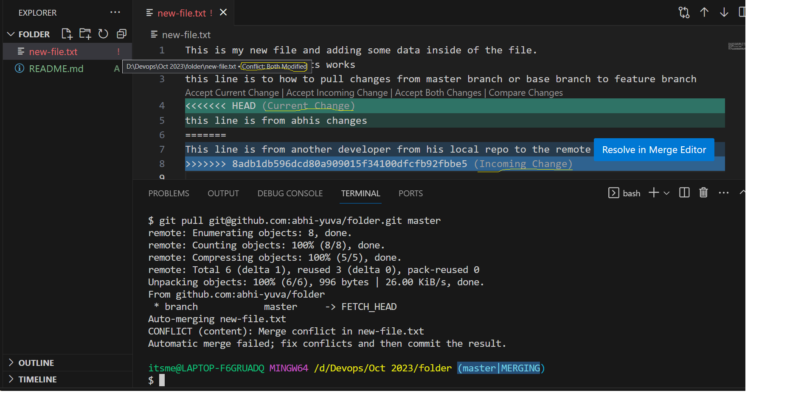

## Git Cont...

### 
-
```
$ git push --set-upstream git@github.com:abhi-yuva/folder.git master
To github.com:abhi-yuva/folder.git
 ! [rejected]        master -> master (fetch first)
error: failed to push some refs to 'github.com:abhi-yuva/folder.git'
hint: Updates were rejected because the remote contains work that you do
hint: not have locally. This is usually caused by another repository pushing
hint: to the same ref. You may want to first integrate the remote changes
hint: (e.g., 'git pull ...') before pushing again.
hint: See the 'Note about fast-forwards' in 'git push --help' for details.
```
- Changes WRT the files in remote & Local Repo

| Remote Repo | Local Repo |
| ------------ | ---------- | 
| This is my new file and adding some data inside of the file. | This is my new file and adding some data inside of the file. |
| to show how our commits works | to show how our commits works |
| this line is to how to pull changes from master branch or base branch to feature branch | this line is to how to pull changes from master branch or base branch to feature branch |
| This line is from another developer from his local repo to the remote repo | this line is from abhis changes |

- When we try to pull our changes and if the same file is having the different changes WRT to the same repo we will be leading to the Merge Conflicts

