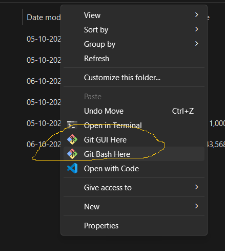
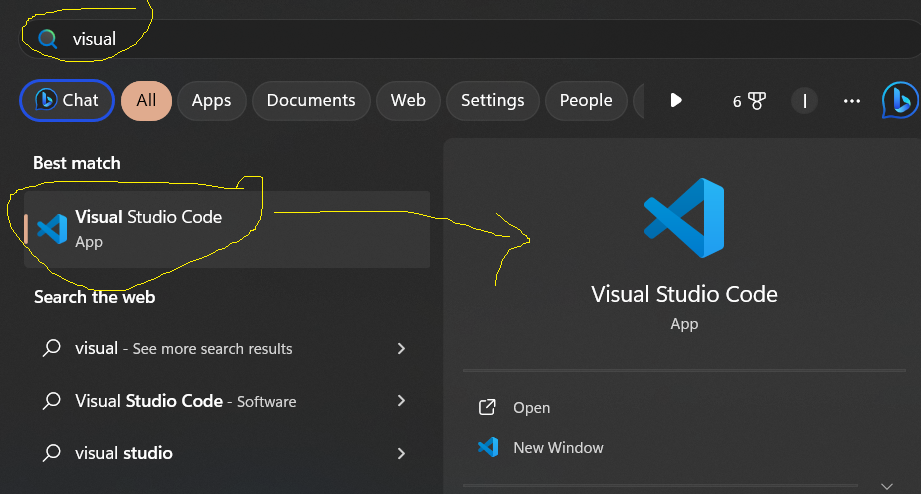

## Git Cont...

### Pre Required Softwares for software Engineer
- Below are the softwares that need to be installed
    1. Chacolatey
    2. Git
    3. Visual Studio Code
### What is package Manager
- There is an package manager where we can use to install or updgrade or unistall any pacakges in our local systems
- Package manager will change according to the OS (Operating System)
    - Windows - chacolatey
    - Linux 
        - Ubunut - apt-get
        - CentOS - yum

    - MAC - brew

### How to use the package manager
- First step is to install the package manager in our local system
- For Linux by deafult it will come up with the pre-istalled package manager
- Here are the links to install Package Manager in your local system
    - [Chacolatey](https://chocolatey.org/install)
    - [Brew](https://brew.sh/)
- Second step is to use commands given by chacolatey to install our softwares
- Open this [Link](https://community.chocolatey.org/packages) to view all the packages supported by Chacolatey
- Example
    - Below are the few commands that will do actions on Google Chrome installation
        - **choco install googlechrome** - It will install the latest version
        - **choco install googlechrome --version=117.0.5938.63** - It will isntall the specified version
        - **choco upgrade googlechrome** - It will upgrade your package instlled in your local system with the latest version available 
        - **choco uninstall googlechrome**  - It will un-install the package from our local system
- Be make sure that upgrage & uninstall works only to the packages which were installed by the support of chacolety.
- Manual installed packages won't support by the chacolatey

### How to install Chacolety
- Go to this [Link](https://chocolatey.org/install) or below is the command to install it
```
Set-ExecutionPolicy Bypass -Scope Process -Force; [System.Net.ServicePointManager]::SecurityProtocol = [System.Net.ServicePointManager]::SecurityProtocol -bor 3072; iex ((New-Object System.Net.WebClient).DownloadString('https://community.chocolatey.org/install.ps1'))
```
- Open powershell with Run-As-Administrator Mode
- Copy and paste the above command and press enter
- It will ask to press Yes to install it, type YES there when promted
- Once you install chacolatey to check if it is installed or not
- Close the powershell and open it again and type the below command
```
choco --version

PS C:\WINDOWS\system32> choco --version
0.11.3
```

### Basic Configuration of Git
- First Step is to install **GIT** in your local system
- Use the below command to install GIT
```
choco install git -y

PS C:\WINDOWS\system32> git --version
git version 2.37.2.windows.2
```
- If you right click in your local system anywhere if you are able to see the below options from the sample image, it mean that it was installed properly


### How to install and use Visual Studio Code
- Use the below command to install **Visual Studio Code**
```
choco install vscode.install
```


### Try to explore complete visual code options
- Below are the options we have to explore
    1. Explore - To clearly see on which folder and file we are working and manage all the files & folders in your repository from here
    2. Search - A global search to find anything in the current folder or file or comlete repository
    3. Source Control - To manage your operation on your source code
    4. Run & Debug - When you use any Scripts or programming languages you can use this option to run your code
    5. Extensions - Which will support for our operations and makes it easier
- Try to install the below extensions in your VS-Code
    - Git Graph
    - Git

