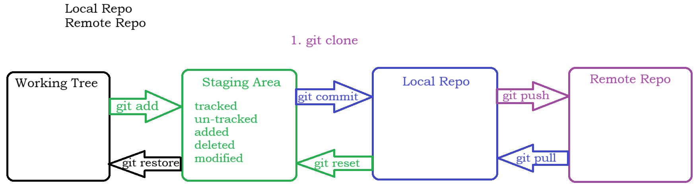
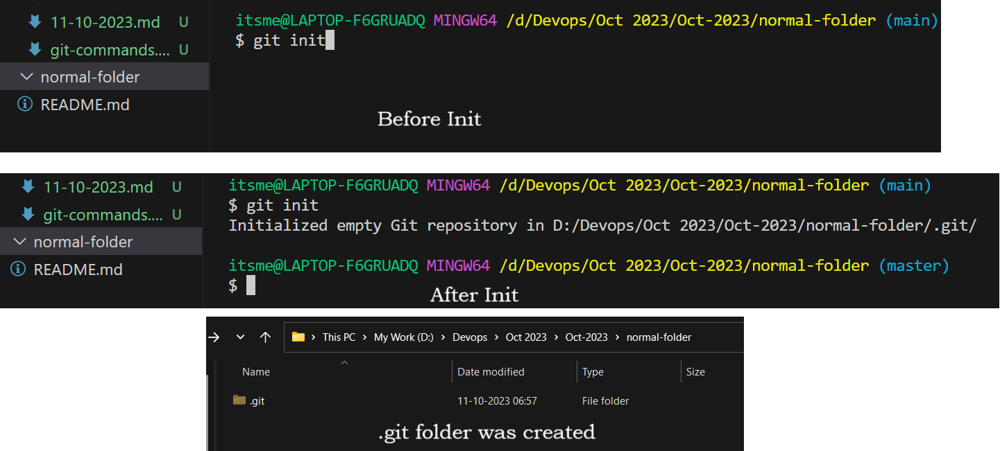
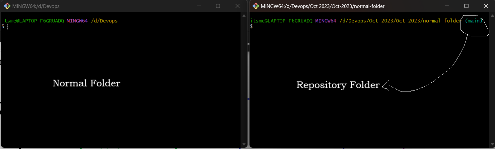

## Git Cont...

### Different Stages in GIT
- Basically when you are working on GIT you will have the below stages
    1. **Working Tree** - Currently you will be in this stage when you are working on the data
    2. **Staging Area** - This is a Temporary Saving of your data in between
    3. **Local Repo**   - The files which are indexed or which are ready to be moved to remote repo
    4. **Remote Repo**  - The remote place where we are storing our data


- A normal folder can also be converted into a repository by typing the below command
```
git init
```


- We can easily find the differences between a normal folder and a repo with the path. See below image for example
 