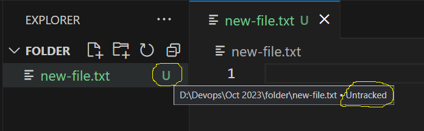

## Git cont...

- when ever we are working on a particualr repo we will have some changes performed by many contributors.
- Along with the raw data we have meta data which will show you the complete information of Author.
- To find out who has done what in the repo.
- For that what we have to do is that we have to configure our credentails in git.

### How to configure the users?
- To configure use details we have a command called
```
git config
```
- While configuring we need to pass 2 variables
    1. Author Name
    2. Author Eamil-id
- From the folder where you have created it as a repo, go to that path and type the below two commands.

```
git config --global user.name "your-username"
git config --global user.email "your-email-id"
```
> Note: Be Mindfull while configuring to change `your-username & your-email-id` with your details

- Once we create any new file or folder in your repository it will be in `untracked list`
- Untracked files are nothing but, it dose not have any information in Local Repo
- When files are in Local Repo it will conatain the **index**
- Index inforamtion will have the following things
    1. Commit ID
    2. Commit Message
    3. Head Position
    4. Branch name

- Untracked files will show as below


- Once you are done with your changes in a file please make sure you will save the data by pressing `ctrl+s` & then try to add the data to staging area.
- To add/move the data from working area to stating area, type the below command
```
git add .
git add <file-name>
```
- `git add .` it will try to move the data from WT to SA of all the files and folder in the current path where you are in.
- `git add <file-name>` it will to move the data from WT to SA of a specifc file


- Once we do `git add` the files will be moved from `untracked` to `added`

- For this index was created
- How to find index details?
- We have a command called `git status` to find the information of your changes

### What is Git Status?
- Will show you the changes that have been made between indexed files and working tree.
- We can see which files are in staging area & which files are in working tree
- It will also show what are untracked files & tracked files