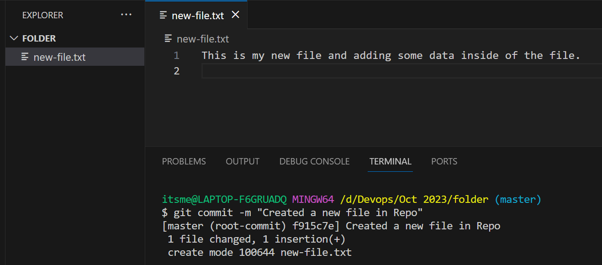
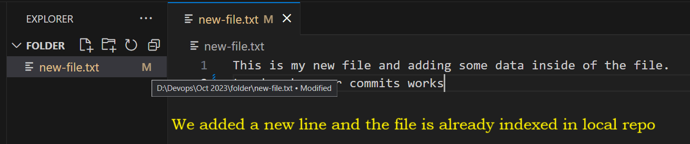

## Git Cont...

- When files are added to the stating area by using command ```git status``` the output will looks like below
```
C:/ (master)
$ git status
On branch master

No commits yet

Changes to be committed:
  (use "git rm --cached <file>..." to unstage)
        new file:   new-file.txt
```

- After moving the files from WA to SA, you have to commit your changes to the files and that can be done with the help of below command
```
git commit

git commit -m "<Commit Message>"
```
> The commit message while working in organization should reflect your changes and don't git commit message normally



- Once you commit your message you are ready to push your changes into your remote repo
- As soon As you commit your chanes a indicator will be created that we will call it as ```HEAD```
- What this **head** is used?
- Head Specifies on which commit it is in and in which particualr branch
- The Head posotion will be move to the lates commit when you did
- In every branch you will have head and it will look at the latest commits
- Every Head will have the following things
    1. The latest changes in the current commit &
    2. History of the parents commit information (changes of all the commits)


- After adding the files into local repo, if you try to change or modify any contet the files will show you as modified insted of created.
- Because you have already added the files into local repo and it has index there, so the files will have the history in your local repo
- The below image explains you how it will show your changes


- After commit it will look like this
```
C:folder (master)
$ git commit -m "Added a new line"
[master 4154632] Added a new line
 1 file changed, 1 insertion(+)
```
- When you do commit it will show you the privew of your changes. It will contain the following things
    1. No of files changed/added/deleted
    2. Commit ID
    3. Commit Message
    4. Symbols for identification
        - + --> Insertion
        - - --> Deletion
        - ~ --> Changes

### How to find the History of a repo/files ?
- To find the history of all the changes or for a specific files we can find it with the help of below command
```
git log
```
- **Git Log** will contain the following information
    1. Commit ID
    2. Commit Message
    3. Author Details (Author Name & Email-id)
    4. Time Stamp
    5. Changes
    6. Commit parents
    7. Head Positioni

- Git log output will looks like this
```
$ git log
commit 4154632b26a6f446c1ddb1fa7ba2e78eb5331d54 (HEAD -> master)
Author: Abhi <devopsbyabhi@gmail.com>
Date:   Fri Oct 13 06:50:58 2023 +0530

    Added a new line

commit f915c7e0bdf067c37e113e7cebd42596c892f575
Author: Abhi <devopsbyabhi@gmail.com>
Date:   Fri Oct 13 06:35:00 2023 +0530

    Created a new file in Repo
```