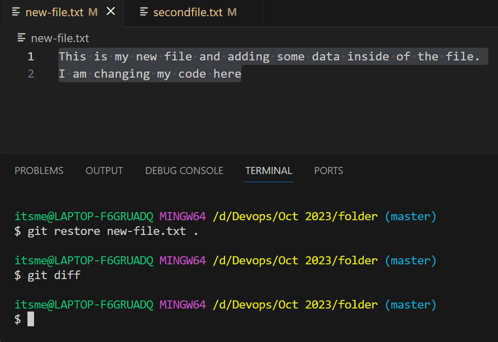
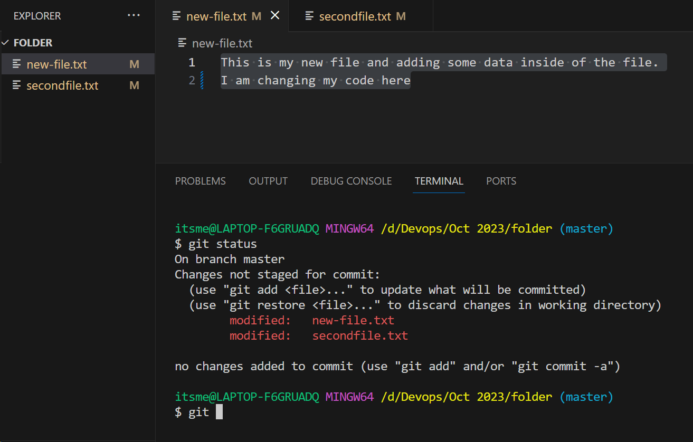

## Git cont...

### Scenario
- I got a requirment to do some enhancements on my code, and once I did all the changes and moved my data to stating area
- Later I got some instructions that the enhancements which I did is no longer required and I want to move my data back to the previous changes
- Here I have an option in git to do this with the help of `RESTORE` command

### Git Restore
- ```git restore``` is used to undo your changes from your code.
- There are 2 way to do this
    1. To the data which are already Stagged
    2. To the data which is un-stagged
- The command to do this is 
```
git restore
```
- To know all the option we have in this please use the below command
```
git restore --help
```
- If you use git status, it will show you what are all the changes that were did for what files in your repo
```
$ git status
On branch master
Changes to be committed:
  (use "git restore --staged <file>..." to unstage)
        modified:   new-file.txt
        modified:   secondfile.txt

Changes not staged for commit:
  (use "git add <file>..." to update what will be committed)
  (use "git restore <file>..." to discard changes in working directory)
        modified:   new-file.txt
```
- Here it will give you an hind on how to undo your changes. 
- For example the below file was changed in the content
```
$ git diff
diff --git a/new-file.txt b/new-file.txt
index c0a9e1e..603bee5 100644
--- a/new-file.txt
+++ b/new-file.txt
@@ -1,2 +1,3 @@
-This is my new file and adding some data inside of the file.
-I am changing my code here
\ No newline at end of file
+This is my file and adding some data inside of the file.
+I am changing my
+ code here
\ No newline at end of file
```
- When we apply `git restore` for unstagged files the out put will be as follows


- When we apply `git restore` for stagged files the out put will be as follows


### Another Scenario
- I did some change and I commited those changes
- Now I want to discard those changes from my local repo
- We have an option called `RESET` to discard your changes from local repo to either staging area or to working directory or to completely remove all the changes
- In technical terms we call those as follows
    1. Soft Reset
    2. Hard Reset
    3. Mixed Reset
- We have a option to view the previous changes with out doing reset
- The `git checkout` command will help you go back to the previous commits and can see the previous data
- This is just a temporary otpion to only view the data but not do reset your changes
- Below is the example
```
$ git log --oneline 
84573ce (HEAD -> master) Adding data to show git reset
e77486e removed and added some changes
fadd701 Added new file & modified the previous file
4154632 Added a new line
f915c7e Created a new file in Repo


$ git checkout e77486e
Note: switching to 'e77486e'.

You are in 'detached HEAD' state. You can look around, make experimental
changes and commit them, and you can discard any commits you make in this
state without impacting any branches by switching back to a branch.

If you want to create a new branch to retain commits you create, you may
do so (now or later) by using -c with the switch command. Example:

  git switch -c <new-branch-name>

Or undo this operation with:

  git switch -

Turn off this advice by setting config variable advice.detachedHead to false

HEAD is now at e77486e removed and added some changes
```
- To discard you changes use `git reset` with options to move the data
- When using this git reset command you have to pass 2 things
    1. Option for reset
    2. commit Id
- Option for reset is nothing the choices (Soft,Hard,Mixed)
- Commit ID to which particular commit you want your changes to be undone

### Git Reset Soft
- When you do `git rest --soft` all your changes will be discarded and data will be moved from local repo to stating area
- You can recheck those and can commit your changes with the latest commit
- With every soft option you have to create a new commit
- But, the older commit will be discarded
- here is the example for that
```
$ git log --oneline 
84573ce (HEAD -> master) Adding data to show git reset
e77486e removed and added some changes
fadd701 Added new file & modified the previous file
4154632 Added a new line
f915c7e Created a new file in Repo


$ git reset --soft fadd701


$ git status
On branch master
Changes to be committed:
  (use "git restore --staged <file>..." to unstage)
        modified:   new-file.txt
        modified:   secondfile.txt


$ git log --oneline 
fadd701 (HEAD -> master) Added new file & modified the previous file
4154632 Added a new line
f915c7e Created a new file in Repo
```