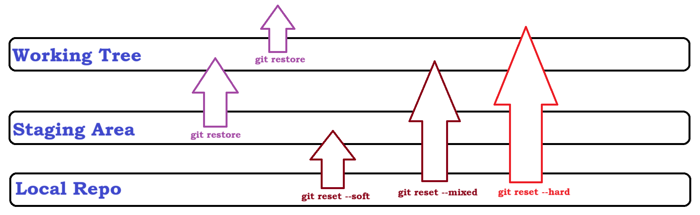

## Git Cont...

### Hard Reset
- Hard Reset will completely remove your data from Working Tree. You have to start doing your changes back again.
- Here when you do Hard Reset, you will be moved to the commit-id to which you have given.
- It is most dangerous command in our git. While using this command make sure you are really need of this to move your changes
- Below is the example of hard reset
```
$ git log --oneline 
356852e (HEAD -> master) Hard reset
4154632 Added a new line
f915c7e Created a new file in Repo


$ git reset --hard 4154632
HEAD is now at 4154632 Added a new line


$ git log --oneline 
4154632 (HEAD -> master) Added a new line
f915c7e Created a new file in Repo
```

### Mixed Reset
- When you do mixed reset, all your data will be moved from local repo to working area
- Here when you use mixed reset, you are allowed to modify your content back and then create a fresh commit to your changes or discard those changes with the help of restore command

```
itsme@LAPTOP-F6GRUADQ MINGW64 /d/Devops/Oct 2023/folder (master)
$ git log --oneline 
60a0d96 (HEAD -> master) Mixed reset
4154632 Added a new line
f915c7e Created a new file in Repo

itsme@LAPTOP-F6GRUADQ MINGW64 /d/Devops/Oct 2023/folder (master)
$ git reset --mixed 4154632
Unstaged changes after reset:
M       new-file.txt


$ git status
On branch master
Changes not staged for commit:
  (use "git add <file>..." to update what will be committed)
  (use "git restore <file>..." to discard changes in working directory)
        modified:   new-file.txt

no changes added to commit (use "git add" and/or "git commit -a")
```

### Diff Between Git Reset & Git Restore
- Restore will try undo your changes from Staging & working tree
- Reset will try to undo your changes from local repo to either Staging Area, Working Tree, or completely discard from the repo


## Branching Strategy
- All the organization will follow this branching strategy but the naming convenstion may differ
- The min agenda of branching strategy is to maintain your code stabel and do not get mixed with the changes from all the developers
- Here is the sample example of branching strategy
    - Main/Master Branch (Use this for Stable code)
    - Feature Branch
        - feature/task-name
        - devloper/task-name
        - task-name

