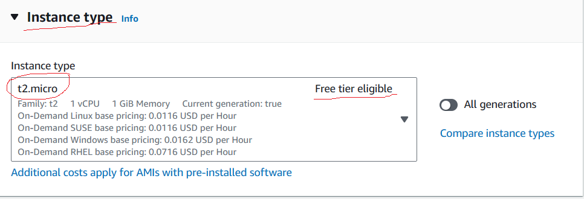

## Jenkin Cont

### Pre-requirements for installing Jenkins
- Here is the list for installing Jenkins 
    - EC2 Server/any Server of Linux OS
    - Java need to be installed (Open-JDK)
    - SSH keys (Later Point)
    - Github Repository (Later Point)

### How to create a Server in AWS
- From AWS console dashboard choose **EC2 service**
- Then Click on **Lanch instance**
- Follow the below steps to create your EC2 Instance

- Once your instance is ready, login into your server
- Follow the below steps to login into the machine
    - Goto EC2 service
    - Choose Instances
    - Select the isntance you have created and click on Connect
    - Select SSH & Under that copy the example code/snippet

